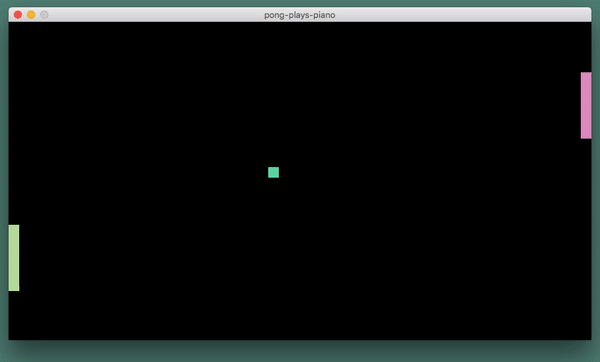

# pong-plays-piano



A game of pong written in pygame

- plays a tone in a sequence of notes each time ball hits a pattle
- pattles change colors each time the music sequence loops
- difficulty goes up gradually

### to play
```
$ python main.py
```

### controls
Player 1:
    - move up: `Q`
    - move Down: `A`

Player 2:
    - move up: `P`
    - move Down: `L`

Reset:
    - `SPACEBAR`
